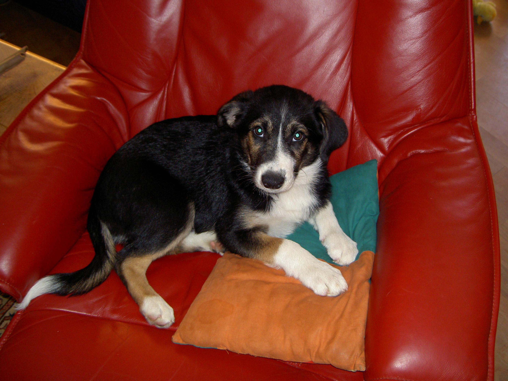
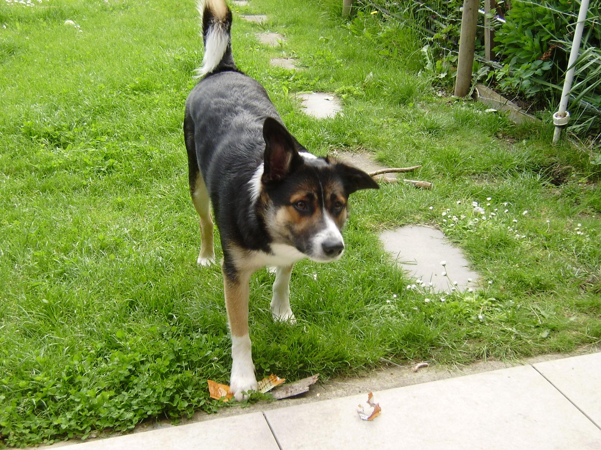

= Asciidoc Presentation
:tags: english

=== Welcome to our little asciidoc document!

.Things I like and things I don't like
|===
|Things I like  |Things I don't like
|Fridays |Mondays
|Java |Assembly
|Dogs |Cats
|===

_These are the things I like and I don't like_

***

=== Cute dog pictures because I don't like cats

.My Dog Aaron as a pupper

.My Dog Aaron as an adult

.Cute dog from the Internet
image::pictures/presentation/cute_pupper.jpg[I am the image alt text.]
.Another Cute Dog from the Internet
image::pictures/presentation/cute_pupper2.jpg[I am the image alt text.]

[quote, Aaron Büchi]
____
Dogs are better than cats, maybe I only say that because I'm a dog...
____

***

== Let's show our list skills
Here we have a little list

.This is a list
. still a list
.. not gonna change that this is a list
... liiiiiiiiist
.... end of the list
. Second part of our list

.This is another list
* list item 1
** nested list item
*** nested nested list item 1
*** nested nested list item 2
* list item 2

